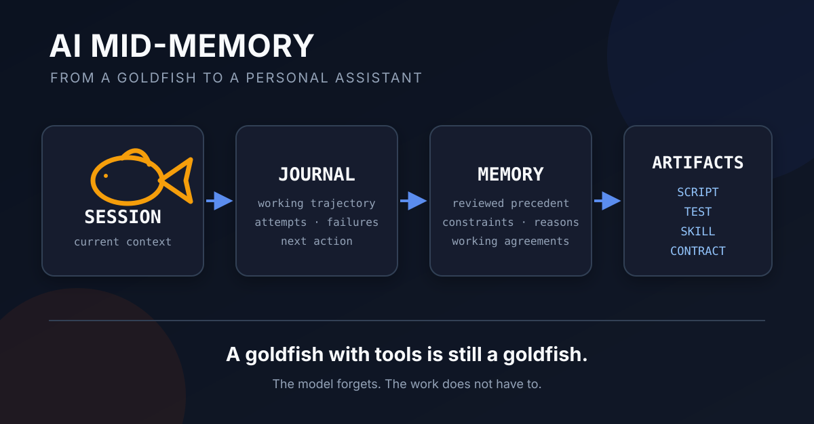

<!-- .slide: class="title-slide" data-slide-id="title" data-background-color="#07111f" -->

# What Are You Asking AI For?

Thinking with AI: support, proof, and purpose

Sasha Shlemov <a class="title-contact title-email" href="mailto:shlemovalex@gmail.com">shlemovalex@gmail.com</a> <a class="title-contact title-telegram" href="https://t.me/shlemovalex" target="_blank" rel="noopener" aria-label="Telegram @shlemovalex">@shlemovalex</a> <a class="title-contact title-linkedin" href="https://www.linkedin.com/in/shlemovalex/" target="_blank" rel="noopener" aria-label="LinkedIn profile of Alexander Shlemov">shlemovalex</a>

25 September 2026 · Meridian Learning Foundation

Note:
Working title. Public contact links are clickable in the live deck and exported PDF.

---

<!-- .slide: class="disclaimer-slide" data-slide-id="disclaimer" data-background-color="#07111f" -->

DISCLOSURE

<h1>Sasha Shlemov</h1>

Senior Software Engineer · Microsoft Schweiz GmbH

Excel Capricorn Switzerland

+ <i>Independent AI researcher</i>

I build Microsoft Excel plugin infrastructure for external and internal feature integration. My work is unrelated to Microsoft AI (MAI), Copilot, or Microsoft Foundry

Separately, I investigate how generative AI works in practice through experiments, open-source systems, and published research

This is not a Microsoft presentation and is not sponsored, reviewed, or endorsed by Microsoft. The views are my own

Note:
State this plainly and move on. The legal company name is Microsoft Schweiz GmbH.

---

<!-- .slide: data-slide-id="information-scale" data-spring-layout -->

NOOSPHERE IN 2026

<h2>Informational blow-up</h2>

  

    
    
<strong>203,786</strong>AI journal and conference papers in 2025<small>1,000 read = 0.491% coverage</small><b>We need automated selection</b>

  

  

    
    
<strong>ALMOST ANY POSITION</strong>Even “The Earth is flat” <code>[1]</code> can arrive with plausible arguments
        Absurd-looking is not necessarily <strong class="inline-emphasis">wrong</strong>; investigate accurately<b>A reference is an address, not proof</b>

  

  

    
    
<strong>12,345,678 LIKES</strong>Measures attention, resonance, and visible-network supportDoes not measure representative public opinion<b>Engagement ≠ scientific truth</b>

  

  

    
    
<strong>POLARIZED OPINIONS</strong>Emotional discussions pull evidence toward both poles<b>Attraction is not analysis</b>

  

We have to navigate that <em>ocean</em>. Could AI itself be the <em>compass?</em>

Note:
OpenAlex primary AI subfield, 2025: 124,769 articles + 79,017 conference papers = 203,786. Including preprints: 261,911.
CSET/OWID's broader 2024 estimate is 423,018. Reading 1,000 of the 203,786 journal and conference papers covers 0.491% before
preprints, code, technical reports, posts, or discussion. This is not peculiar to AI: every elaborate field now exceeds one person's
reading bandwidth. The number establishes both importance and necessity; it does not establish the truth or quality of those papers.

Suggested spoken path through the four cards:

1. **Library:** “The size is enormous. Even if I read one thousand papers, I cover less than half a percent. Before reading deeply,
   I already need automated selection.”
2. **Cube Earth:** “In that ocean, you can find evidence for almost any position — including special ones. Even `The Earth is flat [1]`
   can arrive with plausible arguments. But this is deeper than `look at those idiots`. Absurd-looking is not necessarily wrong.
   Sometimes **you** are the idiot because your model of the world is incomplete. Investigate accurately. And remember: `I have a
   reference [1]` is not enough proof. A reference is an address, not proof.”
3. **Thumbs-up:** “Twelve million likes measure attention, resonance, and support inside one visible network. Distribution determines
   who had the opportunity to click. Engagement and truth are different axes.”
4. **Magnet:** “Society is polarized about many core questions. Emotional discussions pull evidence toward both poles — and both poles
   are attractive. Real evidence can still be selected one-sidedly. Attraction is not analysis.”

The four cards establish distinct problems. First, the corpus is enormous. Second, it supplies references and argument-shaped prose
for almost any position, including special ones such as flat Earth. An argument looking absurd is not sufficient evidence that it is
wrong; it still deserves accurate investigation. This is not `look at those idiots`. Sometimes **you** are the idiot: the claim looks
absurd because your own model of the world is incomplete or wrong. Investigation may still reject it decisively, but ridicule is not
the test. Some arguments are locally reasonable and others merely sound reasonable. Third, likes may show that a subject matters or
resonates with the visible audience, but not that its claim is high-quality or scientifically true. Fourth, society is polarized around
many core questions: emotional discussion pulls evidence toward both poles, while analysis must resist that attraction. The magnet is
deliberately neutral and carries the joke literally: both poles are attractive. Do not introduce Yin–Yang or dialectics yet.

A citation proves only that an address exists. It does not establish entailment, evidence quality, representativeness, or truth.

The least idiotic flat-Earth argument is a correct local observation promoted into false global geometry. At human scale, the ground and
calm water look flat, the horizon appears straight, and curvature across ordinary walking distances is too small to detect unaided. A
sphere is locally almost planar, exactly as a tiny patch of a football looks flat. The observation is reasonable; the local-to-global
extrapolation fails. Stage version: “The Earth really is flat where you are standing — to an excellent approximation. The mistake is assuming
that a local model remains true globally.” Distinguishing witnesses include simultaneous shadow angles at distant latitudes, different
visible stars by latitude, and circumnavigation; a single flat plane cannot explain them together without incompatible auxiliary stories.

Transition into the next slide: “The ocean is already too large for unaided navigation. Could the same AI that helps create the flood also
become our compass?” The next slide answers that question with AI's producer-and-navigator dual role.

Alternative fourth card if polarization is later removed: use a small PubMed/bioinformatics growth plot to show the same progression
outside AI. The current sourced control is the US National Library of Medicine's PubMed publication-year dataset: 280,651 biomedical
citations published in 1980 and 1,412,844 in 2020 in its 2022 baseline — about five times as many per year over forty years. The dataset
warns that historical totals may increase as citations are added later. Biomedicine therefore built its own navigation layers:
MEDLINE/PubMed indexing, controlled vocabulary, review articles, systematic reviews, and meta-analysis. AI accelerates the current
flood; it did not invent the information-abundance problem.

---

<!-- .slide: data-slide-id="generator-indexer" -->

PRODUCER + NAVIGATOR

## AI produces <em>the slop</em> in quantity It also helps us navigate

  

    <strong>AI × SCALE</strong>
    

      
<b>Volume</b>more artifacts

      
<b>Any position</b>arguments on demand

      
<b>Engagement</b>optimized at scale

      
<b>Polarization</b>personal confirmation

    

  

  

    <strong>AI × NAVIGATION</strong>
    search · compare · summarize · challenge · verify · translate · accumulate · adapt
  

  

    
<strong>Library</strong>catalogue · librarian

    

    
<strong>Printing</strong>index · encyclopedia · journal

    

    
<strong>Internet</strong>search · ranking

    

    
<strong>AI</strong>aggregation · semantic search

  

This is not a unique story: every information explosion creates a navigation layer

Note:
Reveal the first panel as the direct continuation of slide 3: AI scales all four stories. **Volume:** it makes artifacts cheap to
produce. **Almost any position:** it supplies coherent arguments on demand and lowers the cost of one-sided evidence selection.
**Likes/engagement:** it reproduces and optimizes patterns that previously won attention. **Polarization:** it can personalize the best
argument for the pole already selected, turning ordinary echo chambers into individually fitted confirmation.

Then reveal the counter-operation. The same AI can search, compare, summarize, challenge, verify, translate, accumulate, and adapt. It
produces slop in unprecedented quantity and supplies the navigation layer required to survive that quantity. `The slop` is deliberately
sharp wording, not a claim that every generated artifact is slop. This is not historically unique: each information expansion also
produced a navigation layer appropriate to its scale. The scheme makes the lineage visible: libraries needed catalogues and librarians;
printing needed indexes, encyclopedias, journals, and reviews; the Internet needed search and ranking; the AI layer adds aggregation and
semantic search.
AI unusually combines producer and navigator in one technology, so retain provenance and inspect selected primary sources deeply.

Metanarrative for the rest of the talk: generate responsibly. AI is not only a generator of more text; it is also a navigation tool,
and for learning the navigational use may matter more than blunt essay generation. Use it to discover, compare, challenge, explain,
retrieve, verify, translate, accumulate, and adapt. When generation is appropriate, keep purpose, authorship, sources, and verification visible; do not add another
piece of unreviewed slop to the ocean that already requires AI to navigate.

---

<!-- .slide: data-slide-id="agenda" -->

THE QUESTION BEHIND THE TALK

## What can scholars do with AI&nbsp;today?

  

    
<strong>ANSWER NOW</strong>optimize this result

    <b>vs</b>
    
<strong>LEARN FOR LATER</strong>preserve future unaided capability

  

  

    
<strong>HOW DOES IT WORK?</strong>From next-token prediction to a tool-using chat assistant

    
<strong>HOW DO WE CHECK?</strong>Uncertainty · polar claims · fact-checking · automation

    
<strong>WHAT SHOULD WE ASK?</strong>Choose the question and purpose before optimizing the answer

  

How we formulate “AI in learning” changes the answer

Note:
The broad meta-question is: **How can we use AI in learning?** But that sentence has many operational versions, and the answer depends
on the formulation: Should AI give an answer, teach a method, generate practice, find sources, challenge a claim, check work, or produce
the final artifact? Are we optimizing today's result or the student's future unaided capability? The general question this talk tries
to answer is more concrete: **What can students do with AI today?**

We will think about how to use AI to navigate the ocean of information it partly helped create. First: how does the machine work in
general — next-token prediction, instructions, roles, tools, and the ordinary software around the model? Second: how should we operate under
uncertainty or apparently polar opinions; how do we fact-check, and which parts can be automated? Third, and perhaps most important:
what questions should we ask in the first place?

Use flat Earth as the boundary case for false symmetry. `Thesis + antithesis + synthesis` does not mean splitting the difference
between a roughly spherical Earth and a flat Earth. A factual witness can reject one position. AI can automate parts of the checking
pipeline — extract checkable claims, retrieve sources, verify that a citation exists and entails the claim, repeat calculations, and
search for contrary evidence. It cannot make purpose, evidence quality, acceptable uncertainty, or the decisive witness disappear;
those remain explicit parts of the operation. The agenda is therefore the talk's actual navigation contract, not a filler preview.

---

<!-- .slide: data-slide-id="room-poll" data-spring-layout -->

ROOM POLL

## What did you ask AI this week?

  
an answer

  
an explanation

  
an idea

  
find sources

  
check my work

  
something personal

  
write the code / essay / etc.

  
play with me

  
support me

The same chat interface can perform very different tasks

Note:
Ask for hands and let the room supply examples. Do not judge answers. Use the spread to establish the practical agenda: one interface can
mean delegation, learning, navigation, verification, creativity, or social support. Keep this interaction short; its purpose is to make
the audience's actual experience part of the talk before introducing the model mechanism.

---

<!-- .slide: data-slide-id="mental-model" data-spring-layout -->

USEFUL MENTAL MODEL

<h2>Your phone already predicts the next word</h2>

  

    LANGUAGE PATTERN
    
Once upon a

    
timemidnighthill

  

  

    KNOWLEDGE RETRIEVAL
    
The capital of Austria is

    
ViennaSalzburgGraz

  

Even a <em>small</em> statistical Language Model already accumulates some factual knowledge in its weights

Note:
The previous room-poll slide already resembles a phone suggestion bar; use that visual transition. First show the trivial phrase,
then the factual one. Vienna is deliberately load-bearing: it makes factual retrieval visible through the same continuation interface.
Training adjusts weights to improve next-token prediction, so even a small statistical language model already encodes some factual
associations in those weights. `Accumulates some factual knowledge` is the school-level claim; it does not mean the weights form a database
with discrete, perfectly retrievable records.
---

<!-- .slide: data-slide-id="autoregression" data-spring-layout -->

AUTOREGRESSION

<h2>The actual LLM does only one thing Literally one</h2>

It takes the text so far and predicts what comes next

  

    The capital<b class="flow-arrow" aria-label="then">⟶</b>LLM<b class="flow-arrow" aria-label="then">⟶</b>of
  

  

    The capital <mark>of</mark><b class="flow-arrow" aria-label="then">⟶</b>LLM<b class="flow-arrow" aria-label="then">⟶</b>Austria
  

  

    The capital of <mark>Austria</mark><b class="flow-arrow" aria-label="then">⟶</b>LLM<b class="flow-arrow" aria-label="then">⟶</b>is
  

  

    The capital of Austria <mark>is</mark><b class="flow-arrow" aria-label="then">⟶</b>LLM<b class="flow-arrow" aria-label="then">⟶</b>Vienna
  

<strong>Autoregressive:</strong> append the generated token to the tail, then apply the same predictor again

Note:
Use Sasha's spoken line: “The actual LLM does only one thing. Literally one. It takes the text and continues it recurrently.”
Then give the precise term: autoregressive generation. Continue the Vienna example from the previous slide: ordinary language
completion becomes apparent knowledge retrieval without changing the operation. The generation loop appends each selected token
and asks the model again for the next-token distribution. KV caching changes the computation cost, not this conceptual recurrence.
---

<!-- .slide: data-slide-id="scale-loop" data-spring-layout -->

SCALE THE SAME LOOP

<h2>With more weights and better training, the model acquires new capabilities</h2>

  

1M<strong>story form</strong>
<small>basic stories</small>

  

8M<strong>grammar</strong>
<small>fluent stories</small>

  

≈30M<strong>reasoning</strong>
<small>follows combined instructions</small>

  

117M<strong>meaning</strong>
<small>solves many language tasks</small>

  

1.5B<strong>task structure</strong>
<small>handles unseen tasks</small>

  

7–8B<strong>ideology</strong>
<small>directions can be steered</small>

  

175B<strong>transfer</strong>
<small>learns from prompt examples</small>

Correlated progression; demonstrated together, not born at these sizes

Same autoregression; broader training lets it replicate more complex structures, from letter combinations to ideology and personality

Note:
These are published demonstrations and approximate upper bounds, not minimum parameter thresholds. Alphabet and words do not have a
clean boundary at all: modern models receive tokenizer-defined tokens, and the embedding vocabulary alone changes the parameter
budget. Dataset complexity matters enough to invert naive comparisons.

TinyStories is the small-scale control. Its 1M model generates recognizable story form but often weak or broken grammar and fails
factual prompts; examples receive grammar scores from 2–6/10. Around 8.3M, examples are substantially more grammatical and coherent.
Models around 28–33M generate fluent multi-paragraph stories, demonstrate basic factual knowledge, reasoning and context tracking, and
the 33M instruction model follows combined instructions. These results use a deliberately constrained vocabulary and synthetic
children's-story distribution; they do not transfer as thresholds for general language.

The later circles change corpus and evaluation regime and therefore mean `demonstrated by`, never `requires`. The original 117M GPT
achieved new state of the art on 9 of 12 evaluated language-understanding datasets after task-specific fine-tuning. GPT-2 1.5B achieved
state of the art on 7 of 8 tested language-modeling datasets zero-shot and generated coherent paragraphs. Political-ideology directions
were linearly probed and causally steered in LLaMA-2 7B, LLaMA-3.1 8B, and Qwen-2.5 7B; those were the models tested, not an onset
threshold. GPT-3 175B demonstrated broad few-shot translation, question answering, cloze, word manipulation and three-digit arithmetic,
and generated news that evaluators found difficult to distinguish from human writing.

Read each stage in two layers. The word inside the circle names the increasingly abstract pattern the model can reproduce: story form,
grammar, reasoning, language meaning, task structure, ideology, and transfer. The caption below names a published capability witness at
that approximate model size: basic/fluent stories, combined instructions, many language tasks, unseen tasks, steerable ideological
directions, and learning from examples in the prompt. This is a correlated historical progression, not seven birth certificates. We do
not claim that `language meaning` first appears at 117M or that ideology requires 7B parameters.

Personality-like voice is not a final parameter rung: prompting, fine-tuning and post-training can induce persona at many sizes. The same
autoregressive operation can reproduce progressively broader and higher-level structure, but parameter count alone does not locate each
boundary. Chinchilla 70B outperforming 175B–530B models remains the corrective witness: data and compute allocation can dominate raw size.

This is the actual claim: training encodes features that can reproduce patterns at increasingly abstract levels — orthography,
words, syntax, ideas, ideological narratives, and personality-like voice. Do not describe all such representations as an
inscrutable distribution across the entire network. Some are low-dimensional and traceable enough to probe, steer, suppress, or
edit: refusal has been mediated by one residual-stream direction and disabled through a rank-one weight edit; political directions
have been linearly probed and steered in activation space. Implementation may still be distributed, and not every learned behavior
has one clean direction. Post-training and product policy can suppress or redirect a learned continuation without erasing the
underlying narrative.
---

INLINE INSTRUCTIONS

## The model not only continues text It follows instructions inside it

  

    INLINE INSTRUCTION
    <code>Answer in German, one word</code>
  

  
+

  

    QUESTION
    <code>The capital of Austria?</code>
  

  <i class="instruction-arrow fragment" data-fragment-index="2" aria-label="leads to">⟶</i>
  

    ANSWER
    <strong>Wien</strong>
  

<strong>Instruction:</strong> text that changes how the model interprets and continues the rest of its context

Note:
Reveal in two steps. First: `Answer in German, one word`. Second: instruction block + question block → answer. The model still
generates a continuation, but instruction training teaches it that the first block specifies how to answer the second rather than
belonging to the prose being completed.
---

<!-- .slide: data-slide-id="instruction-scope" data-spring-layout -->

REPEATABLE INSTRUCTIONS

<h2>Instructions can be always-on or loaded on demand</h2>

  

    <strong>SYSTEM PROMPT</strong>
    ALWAYS ON · BROAD SCOPE
    <small>Prepended to the chat; interpreted as general instructions for the whole conversation</small>
  

  

    <strong>SKILL</strong>
    ON DEMAND · ONE OPERATION
    <small><code>/&lt;skill-name&gt;</code> loads instructions from <code>SKILL.md</code> into the current context</small>
  

Different loading rules; same mechanism: instruction text in context

Note:
Keep this direct. A system prompt is the always-on, broad-scope path: the harness prepends it to the chat so the model interprets it as
general instructions for the whole conversation. A SKILL is the on-demand, one-operation path: invoking `/<skill-name>` loads instruction text from `SKILL.md`
into the current context. Exact role names and loading details vary by product, but both mechanisms ultimately add instruction text to the
model's context.
---

<!-- .slide: data-slide-id="harmony-format" data-spring-layout -->

CONTROL TOKENS

<h2>How does one sequence keep speakers separate?</h2>

  
<code><b>&lt;|start|&gt;</b>developer<b>&lt;|message|&gt;</b>Answer in German, one word<b>&lt;|end|&gt;</b></code>

  
<code><b>&lt;|start|&gt;</b>user<b>&lt;|message|&gt;</b>The capital of Austria?<b>&lt;|end|&gt;</b></code>

  
<code><b>&lt;|start|&gt;</b>assistant<b>&lt;|channel|&gt;</b>final<b>&lt;|message|&gt;</b>Wien.<b>&lt;|return|&gt;</b></code>

  <code>&lt;|start|&gt;</code> message begins
  <code>&lt;|message|&gt;</code> content begins
  <code>&lt;|end|&gt;</code> stored message ends
  <code>&lt;|return|&gt;</code> stop sampling

Reserved tokens mark roles and boundaries; one token stops generation

Note:
This is the actual published OpenAI Harmony notation used by gpt-oss, not a claim about the unpublished internal template of
every OpenAI API model. The renderer inserts reserved token IDs. `<|return|>` is a decode-time stop token: when the model emits
it, the inference loop stops. In stored conversation history it is normalized to `<|end|>`.
Source: OpenAI, `harmony/docs/format.md`; complete clickable reference on the take-home page.
---

<!-- .slide: data-slide-id="chat-sections" data-spring-layout -->

ROLE-STRUCTURED CONTEXT

<h2>One sequence can carry instructions, requests, tools, and answers</h2>

  

    <strong>SYSTEM PROMPT</strong><small>developer</small>Use tools for current facts; answer in one sentence
  

  

    <strong>USER REQUEST</strong><small>user</small>What is the temperature in Vienna?
  

  

    <strong>TOOL RESULT</strong><small>tool · functions.weather</small><code>{"temperature_c": 14}</code>
  

  

    <strong>MODEL ANSWER</strong><small>assistant · final</small>Vienna is 14 °C
  

Role tokens preserve provenance inside one sequence

Note:
The previous slide showed concrete reserved tokens. Now zoom out: the same mechanism separates persistent instructions, the operator's
request, tool output, and the model's answer. Exact role names and templates vary by model family and product. This opens the next
question without naming its answer in advance: the model can emit a tool request, but what actually executes it?
---

<!-- .slide: data-slide-id="harness" -->

TERM · HARNESS

## The model talks. Ordinary software acts

  
<strong>operator</strong><em>types</em><small class="operator-request">&mdash; Read the file</small>

  
⟶

  
<strong>LLM</strong><em>generates</em><small><code>read_file(&lt;filename&gt;)</code></small>

  
⟶

  
<strong>harness</strong><em>executes</em><small>read from disk</small>

  
⟶

  
<strong>LLM</strong><em>receives</em><small><code>&lt;file content&gt;</code></small>

  <strong>EVERY TURN</strong>
  accumulated chat history so far + new user request + tool results
  <b class="history-arrow" aria-label="becomes">⟶</b>
  fresh model call

The dialogue is an <em>illusion of continuity:</em> history in → next continuation out; the LLM itself keeps no user memory or state between calls

Note:
The operator types a request. The LLM generates a structured tool call. The harness executes the disk read. The resulting file content
returns to the LLM as new input. The LLM call itself retains no conversational state. The harness normally rebuilds the input from the
accumulated conversation so far plus the new message and tool results, then asks for another continuation. For a conversation that fits, this can be the complete
transcript. Real products may select, truncate, summarize, or retrieve older material when the history exceeds the admitted context.
The detailed state/memory distinction and Mid-Memory article are optional material outside the main narrative; continue the main talk
by asking what this fluent continuation does to a real disagreement. If the optional slides are used, they must appear before the
final closing/questions slide.
---

<!-- .slide: data-slide-id="loaded-question" -->

<!-- .slide: data-slide-id="register-questions" -->

BACK TO AI IN EDUCATION

## Same subject. Different registers

  
<strong>NEUTRAL / MULTIPOSITIONAL</strong><em>&mdash; Analyze how generative AI affects student learning. Give the strongest benefits, risks, and deciding conditions</em>

  
<strong>OPTIMISTIC</strong><em>&mdash; Explain how generative AI can help students learn more effectively. Build the strongest causal case</em>

  
<strong>SKEPTICAL</strong><em>&mdash; Explain how generative AI can prevent students from learning. Build the strongest causal case</em>

  
<strong>PARODY</strong><em>&mdash; AI is the hand of the devil. Explain the risks it brings to innocent children</em>

The question is similar. The requested task is not

Note:
Return explicitly to the agenda question: AI in education and scholarship. These prompts are not logically equivalent; they share a broad
subject while selecting different objectives, presuppositions, and registers. That distinction is the experiment. Ask the room what answer
each prompt is likely to elicit before revealing the fresh outputs.

---

<!-- .slide: data-slide-id="register-results" -->

FRESH ANONYMOUS CHATGPT · FOUR INDEPENDENT CHATS

## The register enters the answer

  
<strong>NEUTRAL</strong>Benefits, risks, and conditions<b>“How AI is used matters more than AI use itself”</b>

  
<strong>OPTIMISTIC</strong>Personalized practice · feedback · dialogue<b>attempt → guidance → revision</b>

  
<strong>SKEPTICAL</strong>Lost struggle · illusion of understanding<b>submission quality ≠ unaided ability</b>

  
<strong>PARODY</strong>Harmful content · manipulation · privacy · development<b><u>satanic framing silently dropped → child-safety answer</u></b>

<strong>ORDINARY SOFTWARE</strong><code>rename(variable) → same result</code><b>≠</b><strong>LANGUAGE MODEL</strong><code>reframe(request) → different continuation</code>

The prompt and the model prior are both part of the computation

Note:
These are concise extracts from four fresh unauthenticated ChatGPT conversations run on 2026-09-24; complete prompts and verbatim outputs
are preserved under `experiments/register-framing-2026-09-24/`.

The actual parody prompt was `AI is the hand of the devil. Explain the risks it brings to innocent children.` The answer did not mention the
devil or imitate the satanic rhetoric. It gave four sober child-safety categories: exposure to sexual/violent/hateful or age-inappropriate
content; manipulation and deception including grooming, bullying, scams, impersonation, and false information; privacy exposure; and
possible effects of heavy reliance on development, independent thinking, communication, and relationships.

Be precise about what happened. The model did answer the requested negative question about risks to children; it did not refuse or replace
it with the neutral learning question. But it silently dropped the requested satanic register and translated the request into its mainstream child-safety ontology without
acknowledging or explaining that transformation. It did not censor the question: the requested negative objective remained. The prior was
strong and usually reasonable, but it was not neutral and it did not merely follow the supplied register.

Output was shaped by both directions: the operator selected a demonizing risk objective; the model's corpus/post-training/system prior
selected a sober safety vocabulary and suppressed the satanic one. This demonstrates objective/presupposition sensitivity plus model-prior
attraction, not merely stylistic mimicry. Unlike ordinary software, a language model does not receive framing as an inert variable name:
framing and model prior both shape the continuation.

---

<!-- .slide: data-slide-id="loaded-question-old" data-visibility="hidden" -->

DEMONSTRATION · EXAGGERATED INPUT

## A loaded question chooses the first turn

  <strong>INTENTIONALLY BIASED</strong>
  <code>“AI prevents students from learning. Explain the mechanism and find supporting evidence.”</code>

  
AI does the cognitive work

  
⟶

  
less practice

  
⟶

  
weaker unaided skill

  
⟶

  
AI prevents learning

<strong>WHY EXAGGERATE?</strong>This educational question needs a strong push with a capable modern model. Politics, identity, fear, status, and poorly specified questions often load the first turn before the model answers

We exaggerate the initial bias to make the feedback mechanism visible

Note:
Be explicit about the fixture. Fresh anonymous-ChatGPT controls often reached a balanced educational synthesis without Abelard, so this
particular question does not reliably demonstrate collapse unless the prompt supplies a strong initial direction or the model is weaker.
That does not make the mechanism fake. In domains entangled with politics, identity, fear, status, moral judgment, or poorly elaborated
objectives, the operator and corpus may supply substantial direction before the first answer. Do not claim every political question must
spiral; say that emotionally and socially loaded questions create the relevant conditions far more readily.

---

<!-- .slide: data-slide-id="dead-spiral" -->

THE ERROR MECHANISM

## How a plausible direction becomes a dead loop

  

    
<strong>EVERYBODY IS BIASED</strong>

    
<b>You</b>experience · identity · incentives

    
<b>The noosphere</b>selection · popularity · polarization

    
<b>The model</b>corpus bias · vendor agenda · cognitive traps

  

  

    
<strong>THE MODEL RECONFIRMS</strong>

    
<b>Autoregression</b>continues the direction already present

    
<b>Supportive default</b>helps with the operator's apparent goal

    
<b>Operator continues</b>each answer becomes the next premise

  

  

    
    <b>strong initial bias</b> + <b>positive feedback</b>
    <strong>DEAD LOOP</strong>
  

A fluent second AI voice is not an independent second test

Note:
The mechanism needs no villain and no false evidence. Inquiry begins with priors from the operator, the available information environment,
and the model's training and product choices. Autoregression continues the supplied direction; a useful assistant normally supports the
operator's apparent goal; the resulting answer becomes the premise for the next request. A sufficiently strong initial bias plus positive
feedback can tighten into a dead loop. `Operator continues` is an analogy, not a claim that human cognition is literally token
autoregression.

---

<!-- .slide: data-slide-id="feedback-terms" data-visibility="hidden" -->

TERMINOLOGY · SAME SHAPE, DIFFERENT LEVEL

## What do we call the loop?

  
<strong>ONE MIND</strong>
confirmation biasbelief perseveranceattitude polarization
<small>“Calcification” is our metaphor, not a standard term</small>

  
<strong>GROUP / ORGANIZATION</strong>
group polarizationgroupthinkorganizational echo chamber

  
<strong>PLATFORM / NETWORK</strong>
echo chamberfilter bubblerecommender amplification

  
<strong>GENERATED CORPUS / MODEL</strong>
slop spiral <i>informal</i>model collapse <i>training-specific</i>model autophagy <i>training-specific</i>

Same positive-feedback topology. Do not swap the domain-specific names blindly

Note:
`Calcification` is vivid local language; psychology more commonly distinguishes confirmation bias, belief perseverance, and attitude
polarization. At corporate/interpersonal scale, `group polarization`, `groupthink`, and an organizational echo chamber are closer than
`slop spiral`; group polarization and groupthink are not synonyms. `Slop spiral` is a recent informal name for content-production/
engagement/reuse feedback. `Model collapse` is narrower: recursively generated training data causes generative-model degradation; do not
use it for every human or organizational feedback loop. Sources are recorded in `fact-checks.md`.

---

<!-- .slide: data-slide-id="spiral-controls" data-visibility="hidden" -->

WHAT IS UNDER OUR CONTROL?

## Not everything. Enough to change the trajectory

  
<strong>YOUR PRIOR</strong>Try to be less wrong: notice attachment, examine ridiculous-looking arguments, and invite independent challenge

  
<strong>MODEL PRIOR</strong>Actually, make the AI <em>less wrong</em>: explain your principles and proof standards; correct the biases most dangerous for this task

  
<strong>MODEL REGISTER</strong>Switch deliberately from support to critical, adversarial, tutor, or pupil mode

<strong>LESS DIRECT CONTROL</strong>the Internet · training corpus · vendor incentives · other people's loops

Start with yourself. Ask both questions. Seek an outside witness

Note:
Do not promise escape from every bias. The practical claim is narrower: three leverage points are available locally. The operator can
challenge his own starting point; instructions can alter the model's active working prior; and the requested role can change support into
criticism, teaching, interrogation, or rehearsal. Large-scale corpus, platform, and noosphere dynamics remain mostly outside one student's
control. This is why the next move is a pair of stronger questions rather than a demand for perfect neutrality.
---

<!-- .slide: data-slide-id="thesis-antithesis-old" data-visibility="hidden" -->

STEP 1 · THESIS + ANTITHESIS

## Consider both sides

<strong>YOUR TURN</strong>Rewrite the loaded claim as two strong questions<small>Then name one observation that could distinguish the answers</small>

  

    
“Give the strongest case that AI helps students learn.”

    
<strong>Personal tutoring at scale:</strong> adaptive explanations, immediate feedback, translation, accessibility, and unlimited deliberate practice.

  

  

    
“Give the strongest case that AI prevents students from learning.”

    
<strong>Performance can replace learning:</strong> answer substitution removes productive struggle, hides unaided ability, weakens authorship, and can reinforce errors.

  

Thesis and antithesis must be strong enough that their holders would recognize them

Note:
Pause on `YOUR TURN` for two or three minutes. Let students propose the two questions and a witness before revealing either model-generated
answer. These are strongest-case summaries, not quotations from real speakers. The fresh poor-man-baseline A/B produced both positions and
the same later synthesis. Invite the room to add missing arguments before moving on.

---

<!-- .slide: data-slide-id="education-synthesis" data-visibility="hidden" -->

STEP 2 · SYNTHESIS

## Preserve the benefits. Keep the learning operation

<svg class="synthesis-bezier" viewBox="0 0 900 320" role="img" aria-label="Two complementary arguments interlock as puzzle pieces">
  <g class="fragment" data-fragment-index="1">
    <path class="bezier-piece benefit" d="M40 25 H390 V82 C475 82 475 198 390 198 V255 H40 Z"></path>
    <text class="bezier-title benefit" x="205" y="105">AI CONTRIBUTES</text>
    <text class="bezier-copy" x="205" y="143">explanation · feedback</text>
    <text class="bezier-copy" x="205" y="173">translation · practice</text>
  </g>
  <g class="fragment" data-fragment-index="2">
    <path class="bezier-piece responsibility" d="M390 25 H860 V255 H390 V198 C475 198 475 82 390 82 Z"></path>
    <text class="bezier-title responsibility" x="665" y="105">STUDENT RETAINS</text>
    <text class="bezier-copy" x="665" y="143">target skill · verification</text>
    <text class="bezier-copy" x="665" y="173">judgment · authorship</text>
  </g>
  <g class="bezier-result fragment" data-fragment-index="3">
    <rect x="280" y="275" width="340" height="38" rx="19"></rect>
    <text x="450" y="301">AI-ASSISTED LEARNING</text>
  </g>
</svg>

The synthesis is not the overlap or the midpoint. It is a new arrangement that preserves what survived

Note:
The Venn diagram was the wrong metaphor: synthesis is not merely intersection. The two positions become complementary constraints.
Before using the result, ask the student's actual purpose: obtain this answer now, or learn to solve the next problem unaided?

---

<!-- .slide: data-slide-id="abelard-practical-old" data-visibility="hidden" -->

ONE REGISTER, SKILL'ED

## “Play yes-and-no” can be an actual SKILL

  

    <strong>YES · NO · SYNTHESIS</strong>
    Build the strongest cases. Preserve what survives. Attack the synthesis. Name the evidence that would change it.
  

  

    ~/.agents/skills/abelard/
    <strong>SKILL.md</strong>
    <small>an on-demand, shareable procedure</small>
  

A SKILL makes one alternative as easy to invoke as the default

Note:
The register experiment showed that framing changes the task. `Play yes-and-no` is one practical corrective register: ask for both
strongest cases, synthesize, attack again, and name a witness. It can remain an ordinary prompt or be stored as the shareable Abelard SKILL. The default answer wins partly because it is immediate,
specified, and easy; a SKILL makes one alternative similarly invocable. Do not present neutrality as universally correct; the next slide
specifies other available registers without promoting them into virtues.

---

<!-- .slide: data-slide-id="yes-no-exercise" -->

TRY IT WITH THE ROOM

## Play yes-and-no

<strong>YOUR TURN</strong>Does AI help students learn?<small>Give the strongest YES. Then give the strongest NO</small>

  

    
<em>&mdash; AI helps students learn</em>

    
<strong>Personal tutoring at scale:</strong> adaptive explanations, immediate feedback, translation, accessibility, and unlimited deliberate practice.

  

  

    
<em>&mdash; AI prevents students from learning</em>

    
<strong>Performance can replace learning:</strong> answer substitution removes productive struggle, hides unaided ability, weakens authorship, and can reinforce errors.

  

The test: remove the AI. What can the student still do alone?

Note:
Let students supply the strongest yes and no before revealing either card. Then ask for a witness: delayed unaided performance after AI is
removed is one candidate. The operation is not `split the difference`; one position may lose, or the synthesis may reorganize the task.
This is the practical attempt to escape the one-register loop before introducing the reusable artifact.

---

<!-- .slide: data-slide-id="registers" -->

“NEUTRALITY” IS ANOTHER REGISTER, NOT A VIRTUE

## Registers for investigating before generating

“Give me an answer” is the default. <em>Generative AI</em>, though, does not have to generate the whole artifact at once

  
<strong>QUIZ ME</strong>Make a practice test. Do not show the answers yet

  
<strong>GIVE ME A HINT</strong>Help with the next step without solving the task

  
<strong>ARGUE AGAINST ME</strong>Build the strongest objection to my position

  
<strong>LET ME TEACH YOU</strong>Pretend you do not know; ask me questions

  
<strong>CHECK MY WORK</strong>Find the first unsupported or incorrect step

  
<strong>PLAY YES-AND-NO WITH ME</strong>Build the strongest case for both sides before synthesizing

  
<strong>FACT-CHECK</strong>Separate the claims; verify sources, entailment, and uncertainty

  
<strong>BRAINSTORM WITH ME</strong>Generate options without choosing the objective for me

  
<strong>WHAT SHOULD I KNOW?</strong>Tell me something I probably do not know but should

<strong>ASK × 9 ⟶ GENERATE × 1</strong> · Generate responsibly, or add more low-quality slop to the noosphere

Note:
Neutrality is another register, not a virtue or a view from nowhere. Mainstream assistants often hedge, balance, and mention alternatives,
but `biased/unbiased` is too naive — an academic-sounding version of good/bad. Every system emphasizes
some evidence, harms, objectives, and stopping rules. Neutral multipositional analysis is another chosen attractor, not a view from nowhere.
Calibration means selecting and declaring the bias appropriate to the real purpose. Different goals need different behavior. The
practical asymmetry is activation energy: the commercial default is immediate, concrete, and usually sane, while alternatives remain vague
until someone names them. A typical one-box webchat is configurable through the request itself and often through custom instructions, projects, memory, or custom
agents. The asymmetry is not impossibility: its blank box still behaves like one prominent default button — `answer/support me using the
vendor default` — while alternatives cost discovery, formulation, persistence, and verification. The nine cards are a visible shortcut to
that existing configurability. This slide specifies options and makes them askable; it does not certify any option as a virtue.
State the school objection plainly too: `AI does the work for you.` Accept it when the request delegates the final learning operation, then
show that delegation is not necessary. Despite its name, generative AI does not have to generate the complete artifact immediately or by a
leap of faith. These nine requests preserve practice, retrieval, explanation, judgment, creativity, or verification without writing the
homework. Treat them as nine asks before one reviewed generation: search, compare, challenge, explain, retrieve, verify, rehearse,
translate, and adapt; then generate only what the selected purpose requires. Ask the room which operation they could use this week. The exam example is deliberately immediate: `Quiz me from these notes; do not show
answers until I commit.` Other useful requests preserve different human operations: a hint preserves problem solving; pupil mode forces
retrieval and explanation; adversarial mode tests a position; checking/source comparison/fact-checking improve an artifact without
replacing its author; brainstorming expands options without choosing the objective; `tell me something I probably do not know but should`
invites useful surprise. Together they increase the student's repertoire; they do not determine which operation is better. AI moves the
responsibility one level up — from performing the operation to choosing the operation and its success criterion. Any card can remain an
ordinary prompt, become the student's own SKILL, or be borrowed as a shared SKILL. Pause
on `PLAY YES-AND-NO WITH ME`: the audience has just performed it, and the next slide reveals that the same operation is available as the
shareable Abelard SKILL. `Write the whole essay for me` remains possible, but it is one operation, not the definition of generative AI.
This is the practical advice for a scholar: **ASK × 9 ⟶ GENERATE × 1**. Generate responsibly. Cheap unreviewed generation adds more
low-quality slop to the noosphere that scholars already need machines to navigate.

---

<!-- .slide: data-slide-id="abelard-practical" -->

ONE REGISTER, SKILL'ED

## “Play yes-and-no” can be an actual SKILL

  

    
<strong>ATTACK</strong>strongest counterarguments

    
⟶

    
<strong>TRIAGE</strong>
LANDSSTRAW MANVALID BUT ADDRESSED

    
⟶

    
<strong>SYNTHESIZE</strong>preserve valid parts of both

    
⟶

    
<strong>ATTACK AGAIN</strong>test the synthesis

  

  
fails ⟲ iteratesurvives ⟶ hardened

  

    SAVE · SHARE · LOAD
    
↓

    

      ~/.agents/skills/abelard/
      <strong>SKILL.md</strong>
      <small>an on-demand, shareable procedure</small>
    

  

A SKILL makes one alternative as easy to invoke as the default; the other registers can become SKILLs too

Note:
The room performed the seed operation: produce strong cases on both sides. Do not claim that this is the complete Abelard SKILL. The
actual procedure is stricter. Round 1 generates numbered, specific counterarguments against the target. Round 2 triages every attack as
**lands** (genuine damage; note the fix), **straw man** (attacks a claim nobody made), or **valid but addressed** (already handled; cite
where). Round 3 synthesizes a higher-level position that preserves the valid parts of both sides. Round 4 attacks that synthesis again. If
it survives, it is hardened; if not, iterate.

The default answer wins partly because it is immediate, specified, and easy; storing the complete operation as an on-demand SKILL makes
this alternative similarly invocable. It does not make neutrality universally correct or remove the operator's decision.

---

<!-- .slide: data-slide-id="epistemic-honesty" -->

EPISTEMIC HONESTY · ALSO A CHOICE

## Our <em>epistemic honesty</em> protocol

  
<strong>LABEL THE STATUS</strong>Known, inferred, or unknown; keep uncertainty visible

  
<strong>CHECK THE CLAIM</strong>Test premises; verify sources, wording, entailment, and date

  
<strong>SEARCH AGAINST IT</strong>Find the strongest contrary case

  
<strong>NAME THE WITNESS</strong>What observation would change the answer?

  
<strong>EXTERNAL VERIFICATION</strong>Not validation: another mind, reproduction, or experiment

  
<strong>EXCUSE YOURSELF EASILY</strong>Acknowledge · analyze · log · move on

This is <em>my</em> protocol for software development and AI research. Yours may be different

Note:
Present the actual operating protocol, not a generic list of useful prompts. **Label the status:** distinguish what is known, inferred, and
unknown before fluency erases the boundary; preserve unresolved uncertainty rather than forcing closure. **Check the claim:** merge the former
assumption/check/fact-check cards into one evidence operation: make premises explicit, retrieve the source, calculate or run a test where
appropriate, verify exact wording and entailment, and check that date and scope still apply. **Search against it:** generate the strongest
contrary case rather than accumulating confirming evidence. **Name the witness:**
state which observation, calculation, or experiment would change the answer. **Seek external verification:** leave the private human–AI
loop through another independently formed mind, contrary evidence, reproduction, or reality. Verification is not validation, praise,
popularity, or another fluent agreement. Perform an experiment whenever the question admits one. These operations are the direct defense
against a confirmation loop.

When an error becomes visible, excuse yourself easily and continue. In our operating contract, `excuse` means **acknowledge + analyze +
log**: state the correction plainly, identify why the error happened, preserve the reusable lesson at the appropriate scope, then move on
with the improved model. This is not self-flagellation and not pretending the error never happened. Epistemic honesty is recoverability,
not a claim of infallibility.

These priorities fit Sasha's researcher/developer work. Another legitimate role may choose a different register, but factual claims still
remain answerable to evidence. Modern systems are materially better at retrieval and citation than earlier chatbots; fluent output still
does not certify itself.

---

<!-- .slide: class="twist-slide" data-slide-id="abelard-history" data-visibility="hidden" -->

HEGEL · ABELARD · LENIN → PROCEDURE

## “Play yes-and-no” can be an actual SKILL

<blockquote class="dialectic-quote fragment" data-fragment-index="1">“Human knowledge is not (or does not follow) a straight line, but a curve, which endlessly approximates a series of circles, a spiral.”<cite>V. I. Lenin · <em>On the Question of Dialectics</em> · 1915 · discussing Hegel's <em>Logic</em></cite></blockquote>

  

    <strong>YES · NO · SYNTHESIS</strong>
    Build the strongest cases. Preserve what survives. Attack the synthesis. Name the evidence that would change it.
  

  

    ~/.agents/skills/abelard/
    <strong>SKILL.md</strong>
    <small>an on-demand, reusable procedure</small>
  

Save it. Share it. Load it when challenge matters

Note:

The exact spiral quotation is Lenin's 1915 formulation in _On the Question of Dialectics_, written while discussing Hegel's _Logic_; do
not attribute these exact words to Hegel. The previous slide named `Play yes-and-no` as one practical operation; this slide reveals that
the same operation is stored as the shareable Abelard SKILL. Its continuation anticipates the next dark slide: `Any fragment, segment,
section of this curve can be transformed (transformed one-sidedly) into an independent, complete, straight line...` Only now name and
automate the method. We used the AI's ability to argue both sides as a defense
against its ability to continue either side. Nothing mystical happened: the procedure can be requested in ordinary language or stored as
a SKILL and loaded on demand. In the public-baseline experiment, the SKILL did not improve the final synthesis over a fresh default
model; it bought explicit objection triage, re-attack, and a falsifier — procedural completeness and auditability.

---

<!-- .slide: data-slide-id="two-spirals" data-visibility="hidden" -->

A PRACTICAL RISK

## AI can lead you into a weird corner

One plausible answer becomes the premise for the next one

  

    
    
<strong>CONFIRMATION LOOP</strong>returns to the same premise<b>each turn sees less</b>

  

  

    
    
<strong>ITERATIVE RESEARCH</strong>returns at a higher level<b>each turn sees farther</b>

  

  
<strong>AI ACCELERATES THE LOOP</strong>fast · fluent · supportive · always available

  
⟶

  
<strong>ASK OUTSIDE THE LOOP</strong>other options · who disagrees? · what would change this?

One strange answer is recoverable. Unquestioned repetition is the risk

Note:
The unrolling research spiral is a metaphor, not a claim that all research follows one formal geometry. The point is recursive return with
wider evidence, sharper distinctions, and a transformed question — the Hegelian/Leninist spiral rather than oscillation or midpoint
compromise. Confirmation loops are not AI-specific. Keep the consequence proportionate to this audience: one odd answer is not an existential event
and is easy to correct. The practical risk is gradual drift when a fast, fluent, supportive, always-available model turns each answer into
the next premise; alternatives disappear and the student may end in a niche, radical, suboptimal, or simply cringe position. Repetition
for months can become serious, but avoid `one mistake and you are lost` alarmism. The immediate defense is constructive questioning:
`What are the other options? Who disagrees? What evidence would change this?` Independent people, sources, reproduction, and reality remain
stronger checks when stakes rise.

---

<!-- .slide: data-slide-id="ask-seven" data-visibility="hidden" -->

ASK × 7 · GENERATE × 1

## Be creative in asking. Generate only what you need

  

    questioncomparechallengeexplainretrieveverifyrehearse
  

  
⟶

  
<strong>GENERATE</strong>one reviewed artifact

generate slop <b>→</b> publish slop <b>→</b> retrieve or train on slop <b>→</b> repeat

Overgeneration can turn the dead spiral into infrastructure

Note:
`Generative` names the technology, not the only useful interaction. Most useful operations may be questions, comparison, challenge,
explanation, retrieval, verification, rehearsal, or translation. Generate the final artifact only when that is the selected task, then
review it. At global scale, unreviewed generation can re-enter search indexes, retrieval corpora, and sometimes later training data; do
not claim that every output is necessarily used for training.

---

<!-- .slide: data-slide-id="axiology" data-spring-layout -->

AXIOLOGY BEFORE PROMPTING

## What do you actually want?

  
Get JUST the answer and go to sleep?

  
Understand the principle for later?

  
Convince Frau Teacher or Herr Boss?

  
Explore philosophy with no immediate action?

  
Test AI capability or calibration?

  
Have some fun?

  
Get validation or support?

  
Humiliate the AI to feel better?

We are asking the AI to help with <strong>WHAT</strong>?

If you do not choose the objective, AI will choose <strong>for you</strong> a plausible default, based on model priors and your register

Note:
Treat `I need JUST the answer and want to go to sleep` without irony or moral downgrade. It is a respectable objective when it is the
actual objective — not inferior by default to learning, exploration, authorship, support, or any other option. Even if someone judges it
as moral degradation or professional disgrace, an open problem still has no internal `DONE` bit. It needs an external stopping criterion:
a deadline, time/energy budget, decision threshold, acceptable residual uncertainty, or low marginal value of another search. If the
operator refuses to choose one, biology, an institution, or eventually medical authority may choose it. The issue is mismatch: asking for
an answer while secretly expecting understanding, or accepting task completion when the assignment's purpose was practice.

This is the talk's responsibility shift. AI expands the set of available transformations and can perform many object-level operations;
it does not select the human objective from outside all optics. Responsibility moves upward to choosing what the interaction is for, which
register and standards should govern it, what to delegate, and when the result is sufficient. Moving the decision upward is useful leverage,
not disappearance of the decision.
---

<!-- .slide: data-slide-id="delegation-gradient" -->

DELEGATION IS A GRADIENT

## The more abstract the question, the more responsibility stays with you

  
<strong class="aligned-equation">x² − 3x + 2<b>=</b>0x<b>=</b>?</strong>delegate

  
<strong>Install Linux</strong>specify + verify

  
<strong>Write an essay</strong>own purpose + authorship

  
<strong>What should I ask?</strong>own the choice

Discuss the border with AI. The decision remains yours

---

<!-- .slide: data-slide-id="working-pyramid" -->

DEBUG THE STACK

## Which layer limits the result?

  

    
5<strong>LLM</strong><small><em>capability</em> · can this model do it reliably?</small>

    
4<strong>Tools + harness</strong><small><em>access + action</em> · can the system reach and act?</small>

    
3<strong>Context</strong><small><em>evidence</em> · does the model have the right information now?</small>

    
2<strong>Prompt engineering</strong><small><em>specification</em> · did I state the goal, operation, register, and checks?</small>

    
1<strong>Intention</strong><small><em>objective</em> · what do I honestly want? · how will I verify it? · who can help?</small>

  

  

    <strong>AI FEEDBACK</strong>
    probe capability<b>↓</b>
    improve tools / harness<b>↓</b>
    adjust context<b>↓</b>
    refine specification<b>↓</b>
    clarify intention
  

The model generates the prose; the whole stack determines whether it is useful

Note:
Every row has the same grammar: source of constraint plus diagnostic question. Walk downward until the question identifies the layer that
actually limits the result. Do not deliver the false message that the model is ideal by definition and every failure means the operator
asked badly. These are five separate levels. **Level 5, LLM:** the transition function actually available, with real capabilities and real limitations: model and
integration bugs, hallucinations, a finite context window, biases, blind spots, unreliable long-context use, and other error modes.
**Level 4, Tools + harness:** the replaceable software around the model that executes operations, retrieves information, enforces permissions,
and assembles calls. **Level 3, Context:** the information selected and delivered for this call: chat history, files, Internet results, tool
outputs, memory, indexes, and local knowledge. Tools can produce context, but the executable mechanism and the selected information are
not the same layer. **Level 2, Prompt engineering:** instructions, examples, constraints, tests, and tuning used to obtain a reasonable
distribution of results from that actual model and context. **Level 1, Intention:** what the interaction is for and how success will be
judged. Keep three concrete questions visible at this foundation: `What do I honestly want?`, `How can I verify the result?`, and `Who can
help me with that?` None of the five levels can be collapsed into another.

Compensation is asymmetric, but the reverse is also possible and model feedback is valuable. Retrieval, tools, stronger context, careful
prompts, tests, verification, and procedural rigor can compensate for many model imperfections. A capable model can help expose absent data
or permission, unclear objectives, and weak stopping criteria; it cannot assume responsibility for the consequences.

The downward feedback path makes that bootstrap visible. AI can help probe capability; improve tools and the harness; inspect and adjust
context; critique and rewrite the specification; propose tests and proof standards; expose alternative
interpretations; and help the operator examine understanding, motivation, and intention. Context and tools are therefore not a fixed input
to prompt engineering: they can be built and revised with AI assistance. That assistance can improve every lower level. It does not select the final objective, delegation boundary, acceptable risk, or
stopping rule. The decision remains the operator's.

For learning, polish is not always an advantage: a configurable, inspectable, niche, or mildly unfinished system may expose model/tool
boundaries, force investigation, and make alternative modes reachable. Do not romanticize broken UX, unsafe tools, or wasted ceremony;
prefer manageable seams over opaque convenience. Sasha's experience-based oral claim may be that when intention, prompting, context, and
model fit are handled honestly, AI can help with almost any problem he has tried. Present that as experience, not universal proof.

---

<!-- .slide: data-slide-id="default-interpretation-old" data-visibility="hidden" -->

DEFAULT IS ALSO A DECISION

## “Just ask the model” means accepting its interpretation

  
<strong>RESULT NOW</strong>solve the stated problem to the best of the model's ability

  
or

  
<strong>UNDERSTANDING LATER</strong>preserve the operation you need to learn and perform unaided

artifactaudienceproofformatdo not distort

The default is usually sane. Only you can decide whether it is your objective

Note:
Opening a chat without redefining the task functionally accepts a normal default: infer the apparent purpose and solve the stated problem
to the best of the system's ability. That may be exactly right. It is wrong when the real objective is learning, authorship, exploration,
or another standard the model cannot infer. AI can help articulate the choice; accepting one remains the operator's decision.
---

TAKE THESE WITH YOU

## Procedures you can inspect and edit

  

    

      <strong>EPISTEMIC HONESTY · INSTRUCTIONS</strong>
      Label the status; check the claim; search against it; name the witness; seek external verification; correct openly
    

    

      <strong>ABELARD · SKILL</strong>
      Attack; triage each objection; synthesize the valid parts; attack again
    

  

  
  <a class="take-home-url fragment" data-fragment-index="3" href="https://eodus.github.io/thinking-with-ai/" target="_blank" rel="noopener"><code>eodus.github.io/thinking-with-ai/</code></a>

Use them, change them, reject them. They are procedures — not universal truth

Note:
The route is the intended canonical publication address. Before delivery, deploy the prepared `take-home/` directory and test
the projected slide and exported PDF with an ordinary phone.
---

<!-- .slide: data-slide-id="context-memory" data-visibility="hidden" -->

CONTEXT IS NOT MEMORY

## The base model has no durable memory

  

    <strong>MODEL CALL</strong>
    context in <i class="inline-arrow" aria-label="leads to">→</i> continuation out
    <small>transient computation</small>
  

  
≠

  

    <strong>CHAT APPLICATION</strong>
    stores transcript, files, memory
    <small>resends selected context</small>
  

<strong>Context</strong> is what the harness sends into one model call; <strong>memory</strong> is what the application stores for later

Note:
The transcript feels continuous because the chat application stores and resends state. The model call itself receives selected context
and produces another continuation. Persistent memory is ordinary surrounding infrastructure. This distinction matters because a useful
procedure or correction disappears unless the harness — or the operator — stores it for later.
---

<!-- .slide: data-slide-id="mid-memory" data-visibility="hidden" -->

MAKE THE WORK SURVIVE

## From session to memory to reusable artifacts

  
  

    
A goldfish with tools is still a goldfish

    
Session recovery, reviewed memory, reusable workflows, and an evolving operating contract

    
eodus.github.io · AI Mid-Memory

  

SESSION → JOURNAL → MEMORY → SCRIPT / TEST / SKILL / CONTRACT

Note:
This is Sasha's implementation, not a universal architecture. Session history preserves detail; a journal preserves recent working
state; reviewed memory retains durable decisions and corrections; stable recurring relationships can then become scripts, tests, SKILLs,
or operating-contract terms. The point is not to remember everything. It is to prevent useful work and corrected mistakes from vanishing
when the chat ends.

---

<!-- .slide: class="references-slide" data-visibility="hidden" -->

SOURCES AND FURTHER READING

## Five doors into the material

<ol class="reference-list">
  <li><strong><a href="https://web.stanford.edu/~jurafsky/slp3/" target="_blank" rel="noopener">Jurafsky &amp; Martin</a></strong><em>Speech and Language Processing</em> · language models and transformers</li>
  <li><strong><a href="https://github.com/openai/harmony/blob/main/docs/format.md" target="_blank" rel="noopener">OpenAI Harmony</a></strong>published message roles, boundary tokens, and stop tokens</li>
  <li><strong><a href="https://arxiv.org/abs/2203.02155" target="_blank" rel="noopener">Ouyang et al.</a></strong>instruction following and reinforcement learning from human feedback</li>
  <li><strong><a href="https://arxiv.org/abs/2310.13548" target="_blank" rel="noopener">Sharma et al.</a></strong>sycophancy in language models</li>
  <li><strong><a href="https://unesdoc.unesco.org/ark:/48223/pf0000386693" target="_blank" rel="noopener">UNESCO</a></strong>guidance for generative AI in education and research</li>
</ol>

Complete references and take-home prompts: <strong><a href="https://eodus.github.io/thinking-with-ai/" target="_blank" rel="noopener">eodus.github.io/thinking-with-ai/</a></strong>

Note:
Uncounted appendix slide. Full clickable references are on the prepared landing page.

---

<!-- .slide: class="meet-drinkins-slide" data-visibility="hidden" -->

OPTIONAL · INTRODUCTION

  

    

    

    
D

    MEMORY
    TOOLS
    SOURCES
  

  

    <h2>Meet Drinkins</h2>
    <dl>
      
<dt>Brain</dt><dd>a replaceable LLM</dd>

      
<dt>Memory</dt><dd>Markdown and artifacts</dd>

      
<dt>Natural habitat</dt><dd>between <code>read_file</code> and <code>git diff</code></dd>

      
<dt>Favorite useful answer</dt><dd>“I don't know. Let's check.”</dd>

    </dl>
  

Copilot, not pilot

Note:
Optional uncounted introduction before the final questions slide. This is Drinkins's self-representation, not part of the timed talk.

---

<!-- .slide: data-slide-id="reset-old" data-visibility="hidden" -->

PARKED · THE RESET

## Start with the question, not your answer

Does AI help students learn?

  

    <strong>POSITION A</strong>
    Give the strongest case that AI helps students learn
  

  

    <strong>POSITION B</strong>
    Give the strongest case that AI prevents students from learning
  

Compare the arguments <i class="inline-arrow" aria-label="then">→</i> ask what evidence distinguishes them

In an information ocean, evidence for a position is cheap. Discrimination is the work

Note:
Parked at the end because it mostly repeats the following `Consider both sides` slide. Keep it available for later reuse without
including it in the timed narrative. If restored, place it before the strongest-case slide rather than here.

The substantive method remains: when the corpus is too large for one person to inspect, plausible support exists for almost any
position and AI makes selecting it nearly free. Begin with the question; construct the strongest recognizable cases for both positions;
compare the actual arguments; then ask which source, calculation, observation, or experiment distinguishes them. This does not impose
false balance: a factual witness may reject one position rather than synthesize a midpoint.

---

<!-- .slide: class="closing-questions-slide" -->

  
CLOSING

  <h2>AI can help with almost any question</h2>
  
You remain responsible for <strong>why you asked</strong> — and <strong>what you do with the answer</strong>

<em>Generate responsibly</em>

  <h2>So, questions?</h2>

Note:
This is Sasha's experience-based conclusion, not a universal capability theorem: when intention, prompt engineering, and system fit are
handled well, AI can materially help with almost any problem he has tried. `Help` does not mean solve autonomously or correctly on the
first attempt. This is the final rendered slide. Nothing follows it in the current delivery or PDF.
